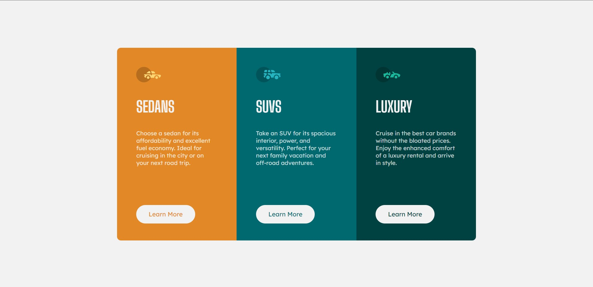

# Frontend Mentor - 3-column preview card component solution

This is a solution to the [3-column preview card component challenge on Frontend Mentor](https://www.frontendmentor.io/challenges/3column-preview-card-component-pH92eAR2-). Frontend Mentor challenges help you improve your coding skills by building realistic projects. 

## Table of contents

- [Overview](#overview)
  - [The challenge](#the-challenge)
  - [Screenshot](#screenshot)
  - [Links](#links)
- [My process](#my-process)
  - [Built with](#built-with)
  - [What I learned](#what-i-learned)
  - [Continued development](#continued-development)
  - [Useful resources](#useful-resources)
- [Author](#author)


## Overview

### The challenge

Users should be able to:

- View the optimal layout depending on their device's screen size
- See hover states for interactive elements

### Screenshot




### Links

- Solution URL: [Add solution URL here](https://your-solution-url.com)
- Live Site URL: [Add live site URL here](https://your-live-site-url.com)

## My process

### Built with

- Semantic HTML5 markup
- CSS custom properties
- Flexbox


### What I learned
- @media
you specify a media query and a block of CSS to apply to the document if and only if the media query matches the device on which the content is being used.

```css
@media (max-width: 930px){
    .container{
        flex-direction: column;
    }
    .Sedans-card{
        border-radius: 10px 10px 0 0;
    }
    .Luxury-card{
        border-radius: 0 0 10px 10px;
    }
    main{
        height:fit-content;
    }
}
```


### Continued development

I don't think so

### Useful resources

- [to use @media](https://developer.mozilla.org/en-US/docs/Web/CSS/@media)


## Author


- Website - working on it
- Frontend Mentor - [@AmrEwais](https://www.frontendmentor.io/profile/AmrEwais)

